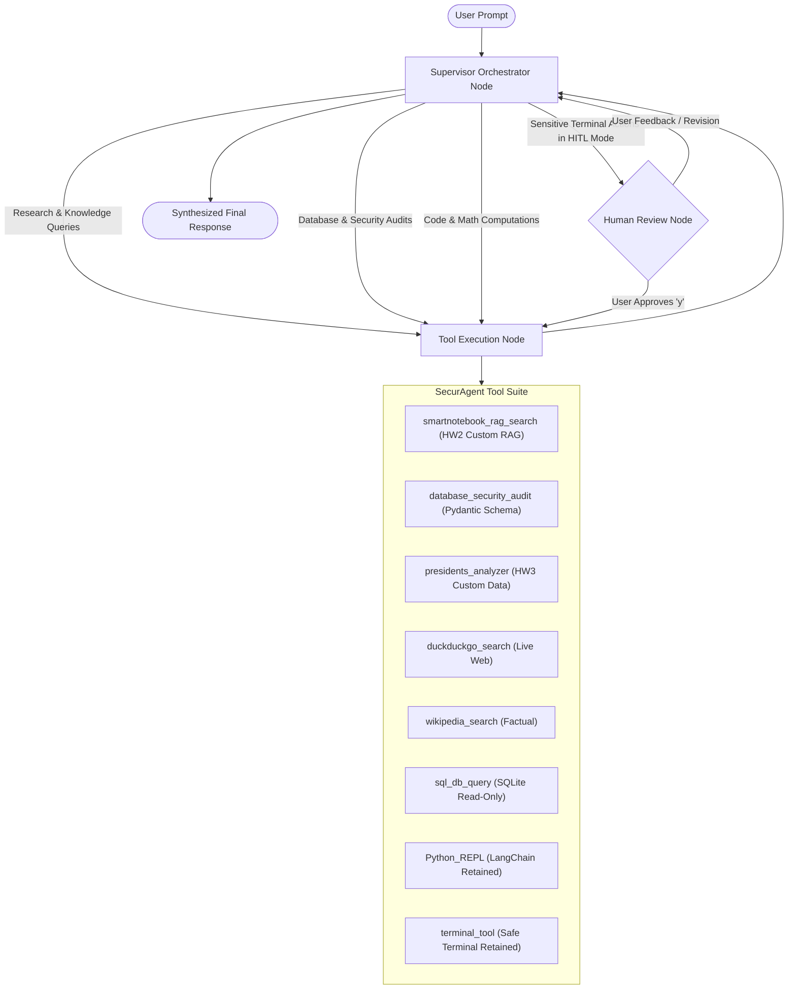

# Homework 3: SecurAgent - Multi-Agent LangGraph System

**Course:** COT4930 - Security (System) Engineering with Generative AI  
**Student:** Liav Dahari (FAU ID: Z23815316)  
**Institution:** Florida Atlantic University  

---

## Executive Summary

**SecurAgent** is an intelligent multi-agent security and research assistant developed for Homework 3. Built upon **LangGraph**, it coordinates specialized domain tasks across AI security research, Azure AD reconnaissance auditing, live web intelligence, Python algorithmic computing, and safe terminal interactions.

The implementation addresses and satisfies all three difficulty tiers and core requirements specified in [HW.md](file:///Users/liavdahari/Documents/FAU%20FALL%202026/COT4930-%20GENSEC/gensec-code/HW3/HW.md):

1. **Retained Tools:** Both the `PythonREPLTool` and a secured `terminal_tool` (`execute_command`) are retained with execution timeouts and safety validation filters.
2. **Level 1 (Built-in Tools & Toolkits):** Real-time web search (`DuckDuckGoSearchRun`), encyclopedic lookups (`WikipediaQueryRun`), and SQLite database query tools.
3. **Level 2 (Custom Tools with Pydantic Validation):**
   - **HW2 SmartNotebook RAG Tool (`smartnotebook_rag_search`):** Integrates the custom `ResearchNoteLoader` from Homework 2, searching structured markdown notes and JSON datasets with strict in-line citations `[Source: filename]`.
   - **Security Audit Tool (`database_security_audit`):** Pydantic-validated security scanner that audits Azure AD privilege escalation paths (`roadrecon.db`) and credential hashes (`metactf_users.db`).
   - **Presidents Longevity Analyzer (`presidents_analyzer`):** Custom analytical tool that computes statistics on the presidential dataset in `presidents.py`.
4. **Level 3 (Custom Architecture - LangGraph Multi-Agent System):** A stateful `StateGraph` featuring a Supervisor Orchestrator, dynamic ToolNode dispatch, `MemorySaver` checkpointer, and a Human-in-the-Loop review interrupt mechanism for sensitive actions.
5. **Clean Starter Code Separation:** Original starter lab scripts (`01` through `08` and `presidents.py`) remain completely untouched as clean reference baselines.

---

## System Architecture



The compiled graph diagram is exported as an artifact to `HW3/agent_graph.png`.

---

## Detailed Tool Suite

| Tier / Level | Tool Name | Schema / Input | Description |
| :--- | :--- | :--- | :--- |
| **Retained** | `Python_REPL` | Python code snippet | Evaluates Python expressions, statistics, and mathematical queries. |
| **Retained** | `terminal_tool` | `TerminalCommandInput` | Executes shell commands with a 15-second timeout and regex safety filters blocking destructive commands. |
| **Level 1** | `duckduckgo_search` | Search query string | Real-time live web search using DuckDuckGo (zero external API keys required). |
| **Level 1** | `wikipedia_search` | Search query string | Retrieves factual summaries and historical entries from Wikipedia. |
| **Level 1** | `sql_db_query` | `SQLQueryInput` | Read-only SQL query runner strictly restricted to `metactf_users.db` and `roadrecon.db`. |
| **Level 2** | `smartnotebook_rag_search` | `SmartNotebookRAGInput` | Direct integration with Homework 2's `ResearchNoteLoader` and notes knowledge base (`HW2/rag_data/notes/`). Retrieves relevant passages with verifiable citations `[Source: filename]`. |
| **Level 2** | `database_security_audit` | `SecurityAuditInput` | Pydantic-validated audit engine inspecting Azure AD privilege tiers (`roadrecon.db`) and user hash algorithms (`metactf_users.db`). |
| **Level 2** | `presidents_analyzer` | `PresidentsAnalysisInput` | Analyzes term lengths and presidential age upon leaving office from `presidents.py`. |

---

## Project Structure

```text
HW3/
├── HW.md                      # Homework specification
├── requirements.txt           # Project dependencies managed via uv
├── tools.py                   # Modular tool suite (Retained, Level 1, Level 2)
├── graph.py                   # Level 3 LangGraph Multi-Agent Architecture & HITL
├── agent.py                   # Main CLI application & interactive REPL
├── test_agent.py              # Automated test suite (14 passing tests)
├── agent_graph.png            # Mermaid-generated architecture diagram
├── presidents.py              # Starter presidential dataset (unmodified)
├── db_data/                   # SQLite database storage (unmodified)
│   ├── metactf_users.db       # CTF users database with PBKDF2 hashes
│   └── roadrecon.db           # Azure Active Directory reconnaissance database
└── [01-08]_*.py               # Original starter lab scripts (unmodified)
```

---

## Setup & Execution

### 1. Virtual Environment Setup with `uv`

As specified in `HW.md`, project dependencies are isolated using `uv`:

```bash
# Navigate to repository root
cd /path/to/gensec-code

# Create isolated virtual environment
uv venv .venv
source .venv/bin/activate

# Install required dependencies
uv pip install -r HW3/requirements.txt
```

### 2. Environment Variables & API Keys

API keys are **never** hardcoded into source code. Set them via environment variables:

```bash
# Google Gemini / Vertex AI
export GOOGLE_API_KEY="your-google-api-key"
export GOOGLE_MODEL="gemini-2.5-flash"

# Optional alternatives supported automatically:
export OPENAI_API_KEY="your-openai-key"
export ANTHROPIC_API_KEY="your-anthropic-key"
```

> **Note:** If no external API keys are configured, SecurAgent automatically operates in **Deterministic Simulation Mode**, enabling complete offline demonstrations and test evaluation.

### 3. Run the Application

#### Interactive REPL Mode
```bash
python HW3/agent.py
```

#### Autonomous Single-Query Mode
```bash
python HW3/agent.py --query "Summarize the key security principles in RAG from my notes"
```

#### Human-in-the-Loop (HITL) Mode
Enables interactive human approval before executing any terminal commands or Python REPL code:
```bash
python HW3/agent.py --hitl
```

#### Export Architecture Graph
Exports `HW3/agent_graph.png` and prints the ASCII topology:
```bash
python HW3/agent.py --draw
```

---

## Verification & Testing

SecurAgent includes an automated test suite verifying every component:

```bash
python -m unittest HW3/test_agent.py
```

### Test Suite Results:
```text
Ran 14 tests in 0.211s

OK
```

The 14 automated tests cover:
- `test_python_repl_tool`: Valid code execution and numerical output.
- `test_terminal_tool_execution`: Safe command execution.
- `test_terminal_tool_safety_filter`: Rejection of dangerous patterns (`rm -rf /`).
- `test_sqlite_query_success`: SELECT queries on `metactf_users.db`.
- `test_sqlite_blocks_write_queries`: Validation rejection of write/drop queries.
- `test_builtin_tool_registration`: Verification of DuckDuckGo and Wikipedia tools.
- `test_smartnotebook_rag_search`: Retrieval from HW2 notes with bracketed citations.
- `test_database_security_audit_metactf`: Detection of PBKDF2 hashes in CTF database.
- `test_database_security_audit_roadrecon`: Audit of Azure AD Global Administrators.
- `test_database_security_audit_pydantic_validation`: Rejection of unauthorized db paths and out-of-range counts.
- `test_presidents_analyzer_modes`: Verification of oldest, youngest, and summary calculations.
- `test_build_agent_graph`: StateGraph compilation and node connectivity.
- `test_export_diagram`: Verification of Mermaid diagram generation.
- `test_graph_execution_flow`: End-to-end prompt processing through the graph.

---

## Example Demonstrations

### Query 1: Custom HW2 SmartNotebook RAG Retrieval
**Prompt:** `"Summarize the key security principles in RAG from my notes"`  
**Result:**
```text
=== Retrieved Context from SmartNotebook RAG (HW2) [Query: 'summarize the key security principles in rag from my notes'] ===

[Result 1] [Source: ai_security_brief.md] Topic: Generative AI Security
Content: # Security Principles in Retrieval-Augmented Generation (RAG)

[Result 2] [Source: ai_security_brief.md] Topic: Generative AI Security
Content: Retrieval-Augmented Generation (RAG) combines dense semantic vector retrieval with generative foundation models.
Key security and engineering principles include:
1. Context Grounding & Prompt Injection Resistance: System prompts must instruct models to restrict answers strictly to retrieved context to mitigate prompt injection and hallucinations.
2. Access Control & Source Segregation: Vector stores must isolate document spaces by tenant or user role to prevent unauthorized data exfiltration.
3. Throttled Batch Ingestion: Ingesting large document collections should use batch chunking (e.g. 20 chunks per batch) to avoid API token exhaustion.
4. Hybrid Retrieval: Combining dense vector embeddings (e.g., text-embedding-004) with sparse keyword search (BM25) provides robust retrieval accuracy.
```

### Query 2: Azure Active Directory Security Audit
**Prompt:** `"Audit privileged roles in roadrecon.db"`  
**Result:**
```json
{
  "audit_target": "ROADrecon Azure Active Directory Database",
  "focus": "privileged_roles",
  "findings_count": 5,
  "findings": [
    {
      "directory_role": "Global Administrator",
      "assigned_users_count": 2,
      "risk_level": "CRITICAL",
      "assessment": "Privileged tier administrator role."
    },
    {
      "directory_role": "Application Administrator",
      "assigned_users_count": 1,
      "risk_level": "CRITICAL",
      "assessment": "Privileged tier administrator role."
    }
  ]
}
```

### Query 3: Presidential Longevity Statistics
**Prompt:** `"Analyze the age of US presidents when leaving office"`  
**Result:**
```json
{
  "total_presidents_analyzed": 45,
  "average_age_at_term_end": 60.78,
  "oldest_at_term_end": {
    "name": "Joe Biden",
    "birth_date": "1942-11-20",
    "end_of_term": "2025-01-20",
    "age_at_term_end": 82
  },
  "youngest_at_term_end": {
    "name": "John F. Kennedy",
    "birth_date": "1917-05-29",
    "end_of_term": "1963-11-22",
    "age_at_term_end": 46
  }
}
```
